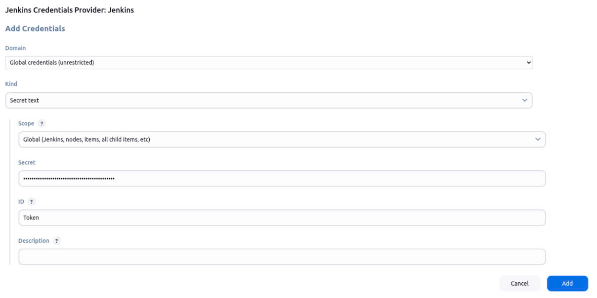

<p align="center">
  <a href="https://www.uit.edu.vn/" title="Trường Đại học Công nghệ Thông tin" style="border: 5;">
    
  </a>
</p>

<!-- Title -->
<h1 align="center"><b>NT548.P11 - Công nghệ DevOps và ứng dụng</b></h1>

## BẢNG MỤC LỤC

- [ Giới thiệu môn học](#gioithieumonhoc)
- [ Giảng viên hướng dẫn](#giangvien)
- [ Thành viên nhóm](#thanhvien)
- [ Hướng dẫn chạy ](#huongdan)

## GIỚI THIỆU MÔN HỌC

<a name="gioithieumonhoc"></a>

- **Tên môn học**: Công nghệ DevOps và ứng dụng
- **Mã môn học**: NT548.P11
- **Năm học**: 2024-2025

## GIẢNG VIÊN HƯỚNG DẪN

<a name="giangvien"></a> 

- Ths **Lê Thanh Tuấn**

## THÀNH VIÊN NHÓM

<a name="thanhvien"></a>
| STT | MSSV | Họ và Tên | Github | Email |
| ------ |:-------------:| ----------------------:|-----------------------------------------------------:|-------------------------:
| 1 | 22520914 | Nguyễn Hải Nam |[NamSee04](https://github.com/NamSee04) |22520914@gm.uit.edu.vn |
| 2 | 22520673 | Lê Hữu Khoa |[kevdn](https://github.com/kevdn) |22520673@gm.uit.edu.vn |
| 3 | 22520864 | Làu Trường Minh |[LiuChangMinh88](https://github.com/LiuChangMing88) |22520864@gm.uit.edu.vn |

## HƯỚNG DẪN CHẠY

<a name="huongdan"></a>
### Khởi động github repo:
- Để kiểm tra quá trình deployment, nhóm em sẽ sử dụng 1 web template có sẵn từ https://www.free-css.com/.
- Sau khi tải 1 web template về, ta upload template đó lên github và sử dụng link github đó để tích hợp CI/CD.

### Set up EC2 trên server AWS:
- Ta tạo 2 EC2 instances (cấu hình là ubuntu và t2.small) đồng thời tạo 1 key-pair (như hình) sử dụng cho 2 instances này:

- Sau khi tạo xong keypair, ta sử dụng keypair đó để tạo 2 EC2 instances (1 cái dùng cho Jenkins, 1 cái dùng cho SonarQube):

- Giả sử key-pair được tải về thư mục download gốc (~/Downloads), ta chạy 2 câu lệnh sau để cấp quyền cho key-pair (key-pair có tên là Group20):

```bash
cd ~/Downloads
chmod 400 Group20.pem
```

- Đồng thời, đổi tên 2 EC2 instances để dễ phân biệt

### Cài đặt Jenkins bên trong EC2 và setup webhook cơ bản:
- Ta SSH vào trong Jenkins bằng lệnh:

```bash
ssh -i Group20.pem ubuntu@<JenkinsEC2-publicIP>
```

- Sau đó, thực hiện các câu lệnh sau để tải jenkins:

```bash
sudo apt update
sudo apt -y install openjdk-17-jdk
sudo wget -O /usr/share/keyrings/jenkins-keyring.asc \
  https://pkg.jenkins.io/debian-stable/jenkins.io-2023.key
echo "deb [signed-by=/usr/share/keyrings/jenkins-keyring.asc]" \
  https://pkg.jenkins.io/debian-stable binary/ | sudo tee \
  /etc/apt/sources.list.d/jenkins.list > /dev/null
sudo apt-get update
sudo apt-get install jenkins
```
- Thêm inbound rule để cho phép port 8080 của jenkins có thể được truy cập từ mọi IP:

- Truy cập vào jenkins bằng browser: \<JenkinsEC2-publicIP>:8080
- Lấy Initial password bằng lệnh:
```bash
sudo cat /var/lib/jenkins/secrets/initialAdminPassword
```
- Đăng nhập vào jenkins bằng mật khẩu có được bằng câu lệnh trên.
- Chọn install suggested plugins:

- Tạo tài khoản admin đầu tiên:

- Sau khi tạo xong tài khoản, ta sẽ được đưa đến trang chủ của jenkins. Chọn new items, tạo 1 Freestyle Project:

- Sau khi tạo xong project, ta định dạng các cấu hình như ảnh (Repository URL là đường dẫn tới repo của mình, branch specifier là branch mà jenkins pipeline sẽ chạy trên.):

- Chuyển đến github repository của mình, ta tạo 1 webhook với các lựa chọn như sau (Payload URL là “https://\<JenkinsEC2-publicIP>:8080/github-webhook/”, events ta chọn Let me select individual events và tích vào pull requests và pushes):


- Ta hoàn thành setup webhook kết nối với jenkins. Giờ mỗi lần ta push code lên github, jenkins pipeline sẽ tự động được kích hoạt (mặc dù hiện tại chưa làm gì cả).
### Cài đặt Sonarqube bên trong EC2 và tạo token:
- Tương tự với jenkins, ta SSH vào trong SonarQube bằng lệnh:
```bash
ssh -i Group20.pem ubuntu@<SonarQubeEC2-publicIP>
```
- Sau đó, thực hiện các câu lệnh sau để cài đặt và chạy SonarQube:
```bash
sudo apt update
sudo apt -y install openjdk-17-jdk
wget https://binaries.sonarsource.com/Distribution/sonarqube/sonarqube-10.7.0.96327.zip
sudo apt install unzip
unzip sonarqube-10.7.0.96327.zip
cd sonarqube-10.7.0.96327
cd bin/
cd linux-x86-64/
./sonar.sh console
```
- Thêm inbound rule để cho phép port 9000 của SonarQube có thể được truy cập từ mọi IP:

- Truy cập vào jenkins bằng browser: \<SonarQubeEC2-publicIP>:9000
- Đăng nhập vào SonarQube với user: admin, password: admin

- Tạo mật khẩu mới theo ý muốn, sau khi tạo xong ta sẽ được chuyển đến trang chủ.
- Chọn create a local project:

- Đặt tên cho project tùy ý (key sẽ được mặc định y chang tên):

- Sau khi đặt xong, chọn global settings, tiếp đến ta sẽ được cho lựa chọn CI mà mình muốn dùng, ta chọn Jenkins.

- Devops platform ta chọn Github

- Ở phần Jenkinsfile, vì ta thực nghiệm trên 1 webapp sử dụng HTML và CSS, ta chọn Other

- Ta lưu lại các configuration mà SonarQube đưa ra để sử dụng sau này:

- Chuyển đến phần My account ở góc trên bên phải để tiến hành tạo token:

- Sau khi vào my account, chọn security, tạo 1 token với tên tùy ý và token type là Global Analysis Token và lưu lại token key:

### Tích hợp SonarQube-Scanner bên trong Jenkins pipeline:
- Quay trở về \<JenkinsEC2-publicIP>:8080, từ trang chủ, ta chuyển đến manage jenkins -> plugins -> available plugins và tải SonarQube Scanner plugin về

- Chuyển đến manage jenkins -> tools -> SonarQube Scanner installations - > Add SonarQube Scanner với tên là SonarScanner

- Chuyển đến manage jenkins -> system -> SonarQube server -> Add SonarQube và tạo authentication token mới như sau (Secret là token key ta tạo ngay trên, ID là tùy ý):

- Sau khi tạo xong token, ta dùng token đó để tạo SonarQube(Name chọn tùy ý, Server URL là https://\<SonarQubeEC2-publicIP>:9000 và server authentication token là ID của token ta vừa tạo):

- Chuyển đến job -> configure -> Build steps -> Add build step -> Execute SonarQube Scanner:

- Ở analysis property, ta khai báo tên project đã tạo ở server sonarqube:

- Sau khi đã hoàn thành các bước trên, ta có thể build thử từ trang chủ pipeline của jenkins. Sau khi build thử, ta đến web của SonarQube -> projects và có thể thấy kết quả scan code của SonarQube.

### Deploy App đến server Kubernetes:
- Bên trong CLI của jenkins, ta chạy các lệnh sau để cài đặt kubernetes, eks, helm, docker và cấp permission cho jenkins: 
```bash
curl "https://awscli.amazonaws.com/awscli-exe-linux-x86_64.zip" -o "awscliv2.zip" 
sudo apt install unzip
sudo unzip awscliv2.zip
sudo ./aws/install
```
```bash
curl -fsSL -o get_helm.sh https://raw.githubusercontent.com/helm/helm/master/scripts/get-helm-3
sudo chmod 700 get_helm.sh
sudo ./get_helm.sh
```
```bash
curl -LO "https://dl.k8s.io/release/$(curl -L -s https://dl.k8s.io/release/stable.txt)/bin/linux/amd64/kubectl"
curl -LO https://dl.k8s.io/release/v1.31.0/bin/linux/amd64/kubectl
sudo install -o root -g root -m 0755 kubectl /usr/local/bin/kubectl
```
```bash
curl --silent --location "https://github.com/weaveworks/eksctl/releases/latest/download/eksctl_$(uname -s)_amd64.tar.gz" | tar xz -C /tmp
sudo mv /tmp/eksctl /usr/local/bin
```
```bash
sudo apt-get update
sudo apt-get install ca-certificates curl
sudo install -m 0755 -d /etc/apt/keyrings
sudo curl -fsSL https://download.docker.com/linux/ubuntu/gpg -o /etc/apt/keyrings/docker.asc
sudo chmod a+r /etc/apt/keyrings/docker.asc
echo \
  "deb [arch=$(dpkg --print-architecture) signed-by=/etc/apt/keyrings/docker.asc] https://download.docker.com/linux/ubuntu \
  $(. /etc/os-release && echo "$VERSION_CODENAME") stable" | \
  sudo tee /etc/apt/sources.list.d/docker.list > /dev/null
sudo apt-get update
sudo apt-get install docker-ce docker-ce-cli containerd.io docker-buildx-plugin docker-compose-plugin
sudo docker run hello-world
sudo groupadd docker
sudo usermod -aG docker $USER
newgrp docker
```
```bash
sudo usermod -a -G docker jenkins
sudo service jenkins restart
sudo systemctl daemon-reload
sudo service docker stop
sudo service docker start
```
- Sau khi chạy xong những câu lệnh trên, nếu đúng, khi ta refresh web jenkins, jenkins sẽ restart, ta sẽ phải đăng nhập lại bằng tài khoản vừa tạo trước đó.
- Tải thêm 2 plugins là docker và docker pipeline tương tự như tải plugin SonarQube Scanner đã hướng dẫn ở trên.
- Tạo 1 ECR repo với các lựa chọn như sau:

- Tạo 1 Dockerfile trên github để build docker image (dockerfile ở trên github).
- Tạo 1 IAM role mới:

- Chọn AWS service và use case EC2:

- Chọn policy AdministratorAccess -> next -> đặt tên cho IAM role -> hoàn tất.
- Gán IAM role vừa tạo cho Jenkins instance:

- Chuyển đến terminal đang chạy server jenkins, chạy các dòng lệnh sau:
```bash
sudo su - jenkins
eksctl create cluster --name eksGroup20 --region us-east-1 --nodegroup-name Group20Node --node-type t3.small --managed --nodes 1
```
- Sau khi create xong cluster ở trên, ta tạo 1 namespace mới tên helm-deployment bằng lệnh:
```bash
kubectl create ns helm-deployment
```
- Sử dụng helm để tạo helmchart giúp quá trình deploy (ta tạo template trước, sẽ thay đổi sau).
- Quay trở lại trang chủ của jenkins, tạo thêm 1 job mới: pipeline job với tên tùy thích, sau khi tạo xong pipeline job, ta thay đổi các cấu hình tương tự như pipeline ở trên (Pipeline này sẽ dựa vào jenkinsfile trên github repo):

- Để hoàn thành pipeline CD, ta chỉ còn cần các thay đổi bên trong github: tạo dockerfile, jenkinsfile và hoàn tất helmchart:
- Ở ECR repo ta vừa tạo ở trên, bấm vào push commands để lấy những thông tin cần thiết:

- 